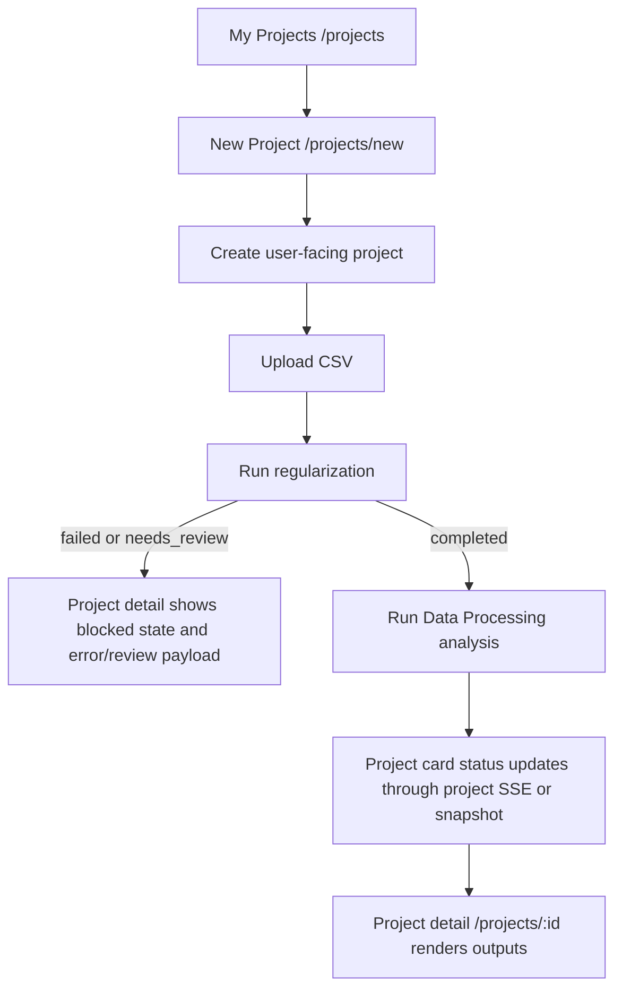

# Data Processing Project Entry Implementation Checklist

> Goal: make "我的项目 -> 新建项目 -> upload CSV -> regularize -> analyze -> project card/detail" the canonical Data Processing E2E path.

## Target Architecture

## Implementation Strategy

Use projects as the product-facing resource and Data Processing jobs as execution internals.

The preferred backend shape is:

- `POST /api/analysis/projects` creates a project with Data Processing defaults.
- `POST /api/analysis/projects/{project_id}/dataset` uploads the raw CSV/Excel and creates or reuses the internal job.
- `POST /api/analysis/projects/{project_id}/regularize` runs Data Processing regularization.
- `POST /api/analysis/projects/{project_id}/run` starts Data Processing analysis only after regularization is complete.
- `GET /api/analysis/projects` lists Data Processing-backed projects.
- `GET /api/analysis/projects/{project_id}` returns project-facing status, linked `job_id`, stages, quality summary, capability summary, output refs, and errors.
- `GET /api/analysis/projects/{project_id}/events` streams project-facing status changes even when the underlying event came from the Data Processing job.

If the team wants the smallest implementation slice, the first PR can keep `/api/analysis/jobs...` as the execution API, but it must still create/update a project wrapper that appears in `/api/analysis/projects`.

## Phase 0 - Contract Decision

- [ ] Decide whether Retail V2 remains temporarily selectable or is replaced by Data Processing as the default.
- [ ] Decide whether `/data-processing` remains as a debug route or is removed from the main nav.
- [ ] Decide whether upload supports CSV only in the product flow or CSV/XLS/XLSX like the job API.
- [ ] Confirm the project detail result layout for Data Processing outputs: overview, profile segmentation, association, recommendation, promotion, summary, sidecars.

## Phase 1 - Backend Project/Job Bridge

- [ ] Add a backend project-facing model field or metadata convention: `analysis_kind = "data_processing"` and `job_id`.
- [ ] Add or update project creation so the new default project is Data Processing-backed.
- [ ] Ensure project list returns Data Processing-backed projects with stable fields used by the frontend: `id`, `name`, `description`, `status`, `dataset_ref`, `quality_summary`, `stage_statuses`, `artifact_refs`, `job_id`, `error`, `created_at`, `updated_at`.
- [ ] Add a project-facing upload path that stores the raw file for the linked job.
- [ ] Add a project-facing regularization path, or make project upload trigger regularization when the product flow requires a single confirmation.
- [ ] Add a project-facing run path that calls Data Processing analysis after successful regularization.
- [ ] Map Data Processing statuses to project statuses:
  - `queued` -> `queued`
  - `processing` -> `processing`
  - `completed` -> `completed`
  - `failed` -> `failed`
  - `needs_review` -> project status `failed` or a new frontend-supported `needs_review` status; choose one explicitly.
- [ ] Map Data Processing stages to project detail `stage_statuses`.
- [ ] Map Data Processing `quality` into project `quality_summary`.
- [ ] Map Data Processing `output_refs` into project `artifact_refs` or add a typed `output_refs` field to the frontend project type.
- [ ] Ensure project deletion deletes or hides the linked Data Processing job state and artifacts.
- [ ] Ensure project SSE emits updates when the underlying Data Processing job changes.

## Phase 2 - Backend Contract Tests

- [ ] Add API contract test for the expected product E2E path:
  - create project
  - upload dataset
  - regularize
  - run analysis
  - list projects
  - get project detail
  - list outputs or artifacts through project detail
- [ ] Add test that failed regularization or `needs_review` stops before analysis.
- [ ] Add test that a Data Processing-backed project appears in `GET /api/analysis/projects`.
- [ ] Add test that project detail includes linked `job_id` and Data Processing stage statuses.
- [ ] Add test that project SSE snapshot has project-facing status and fallback URL.
- [ ] Update `tests/api/test_frontend_api_matrix_contracts.py` to cover fields consumed by `ProjectCreate.vue`, `ProjectList.vue`, and `ProjectDetail.vue`.

## Phase 3 - Frontend API Boundary

- [ ] Add typed wrappers in `frontend/src/api/` for any new project-facing endpoints, for example:
  - `regularizeProjectDataset(projectId)`
  - `getProjectDataProcessingOutputs(projectId)`
  - `getProjectDataProcessingSidecar(projectId, sidecarId)`
- [ ] Keep page components calling wrappers only; do not add page-local axios calls.
- [ ] Update `RetailProject` type or introduce a neutral `AnalysisProject` type that supports Data Processing fields.
- [ ] Add `needs_review` to frontend status normalization if that status remains visible.
- [ ] Remove Retail-only wording from wrappers and page messages where the flow is now generic Data Processing.

## Phase 4 - Project Creation UI

- [ ] Update `frontend/src/views/ProjectCreate.vue` to call the Data Processing-backed project lifecycle.
- [ ] Preserve the three-step UX: basic info, data upload, confirm analysis.
- [ ] On final confirmation, execute:
  - create project
  - upload dataset
  - regularize
  - if `failed` or `needs_review`, navigate to project detail with blocked state
  - if regularization completed, start analysis
  - navigate to `/projects/{project_id}` with status polling/SSE enabled
- [ ] Show a clear error/review message when regularization stops the flow.
- [ ] Accept the file types decided in Phase 0.
- [ ] Remove "Retail V2" user-facing copy from the new-project flow.

## Phase 5 - Project List and Detail UI

- [ ] Ensure `frontend/src/views/ProjectList.vue` lists Data Processing-backed projects.
- [ ] Ensure project cards display Data Processing dataset filename, status, and updated time.
- [ ] Update `frontend/src/views/ProjectDetail.vue` to render Data Processing stages and outputs when `analysis_kind` or linked `job_id` indicates Data Processing.
- [ ] Add detail sections for regularization quality, capability, skipped reasons, outputs, and sidecars.
- [ ] Ensure the detail page supports terminal states: completed, failed, needs_review.
- [ ] Ensure the detail page can re-run regularization/analysis only through valid backend states.

## Phase 6 - Route and Navigation Cleanup

- [ ] Remove "数据处理" from top-level nav or mark it as debug/admin according to the Phase 0 decision.
- [ ] If `/data-processing` remains, prevent it from being the canonical user entry.
- [ ] Redirect `/data-processing/jobs/:jobId` to `/projects/:projectId` when the job has a linked project.
- [ ] Update docs that currently describe `/data-processing` as the frontend entry.

## Phase 7 - E2E Verification

- [ ] Add or update E2E test for the canonical path:
  - open `/projects`
  - click "新建项目"
  - fill basic info
  - upload CSV fixture
  - confirm analysis
  - observe regularization progress
  - observe analysis progress
  - return to project list
  - click project card
  - verify result/detail sections
- [ ] Add E2E case for bad input data causing regularization failure or `needs_review`.
- [ ] Add API-level smoke for the same backend path to isolate frontend flakiness.
- [ ] Verify no E2E depends on manually typing `project_id` in `/data-processing`.

## Quality Gates

- [ ] `make lint`
- [ ] `make format`
- [ ] `make lint`
- [ ] Backend touched scope: `uv run pytest tests/api/test_retail_analysis_contracts.py tests/api/test_data_processing_analysis_contracts.py tests/api/test_frontend_api_matrix_contracts.py`
- [ ] Frontend build: `npm run build` from `frontend/` or `make build`
- [ ] Full check before handoff: `make check`

## Rollback Plan

- Revert frontend calls in `ProjectCreate.vue` to the previous Retail wrappers.
- Keep `/data-processing` job page available as a fallback while the project bridge is being stabilized.
- Disable the project-facing Data Processing route by feature flag or backend config if project state migration exposes data inconsistency.

## Definition of Done

- "新建项目" triggers Data Processing regularization and analysis, not Retail V2.
- Data Processing results appear in "我的项目".
- Clicking a project card opens a project detail page that displays the linked Data Processing status and outputs.
- Failed or review-required regularization stops analysis and is visible in the project detail.
- The standalone `/data-processing` page is no longer the only usable Data Processing UI path.
