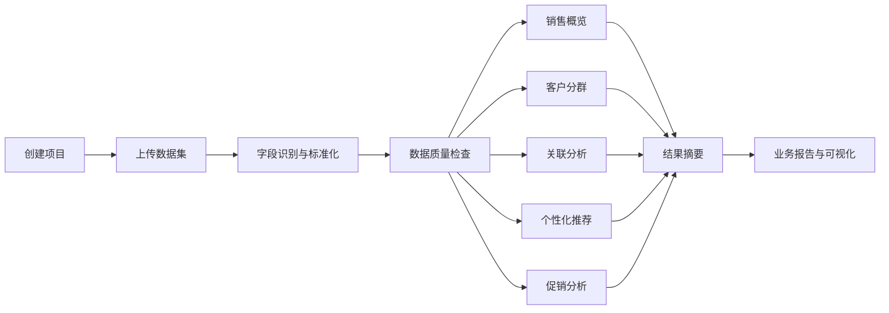
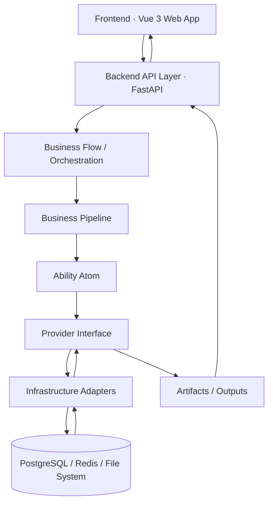
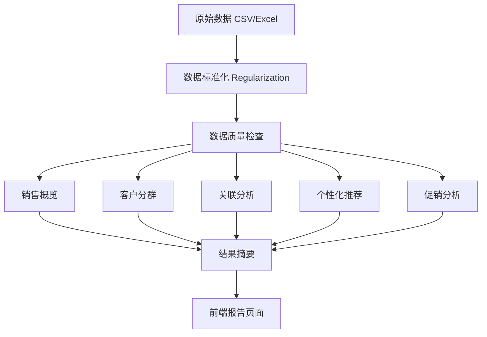

# MarketMind 项目介绍与 Intro 页面内容 Brief

> 本文档基于 `docs/ARCHITECTURE.md`、`docs/requirement/`、`analysis/`、`backend/`、`frontend/` 等实际项目资料整理。
> 用于指导 Intro HTML 讲解页面的内容设计和文案撰写。

---

## 1. 项目一句话介绍

MarketMind 是一个面向超市零售场景的数据分析与营销洞察平台 —— 用户上传销售明细数据后，系统自动完成数据标准化、质量检查、销售概览、客户分群、关联规则挖掘、个性化推荐和促销效果分析，并输出业务可读的图表与行动建议。

---

## 2. What：这个项目是什么？

### 2.1 面向用户

| 角色 | 需求 |
|------|------|
| 营销经理 | 制定促销组合、发券名单、客群策略、商品推荐、品类经营决策 |
| 门店管理层 | 查看经营摘要、销售趋势、客户结构、营销优先级 |
| IT 经理 | 管理数据接入、任务调度、错误追踪、产物存储 |
| 数据分析师 | 校验模型结果、调整参数、解释算法结论 |

### 2.2 核心能力

- **数据接入与标准化**：支持 CSV/Excel 上传，自动识别中英文混合字段名（如"顾客编号"/"user_id"等 190+ 别名），处理 GBK/UTF-8 编码，统一字段格式
- **数据质量诊断**：检查缺失率、重复行、无效日期/金额、退货标记，输出质量报告与字段覆盖评分
- **销售概览**：总销售额、订单数、客单价、退货率、品类帕累托分析、日销售趋势
- **客户分群**：基于 RFM 指标 + KMeans + K-Scan（轮廓系数 + DB 指数）自动选择最佳分群数，输出群体画像与销售贡献占比
- **关联规则挖掘**：FP-Growth 算法发现购物篮中的商品组合关系（support/confidence/lift），支持 item / 小类 / 中类多层级；结合高效用项集挖掘（HUIM）发现低频高客单价组合
- **个性化推荐**：多召回信号（热门/类目偏好/关联规则/复购周期/促销适配/价格偏好）+ CRITIC-TOPSIS 融合排序，输出 Top-K 推荐商品、分数与推荐理由
- **促销效果分析**：朴素均值差 vs DML（Double Machine Learning）去偏 ATE 对比，控制价格、品类、时间等混淆因素，判断促销是否真正带来额外销售增长
- **结果摘要**：将所有分析模块结果汇总为结构化概要

### 2.3 输入与输出

**输入**：超市/零售销售明细数据（CSV 或 Excel），包含商品编码、顾客编号、销售日期、销售金额、销售数量、商品单价、是否促销、类目信息等字段。

**输出**：
- 标准化数据集、字段映射明细、数据质量报告
- 销售概览指标（总销售额、客单价、退货率、品类贡献、日趋势）
- 客户分群结果（分群数、轮廓系数、分群画像、K-Scan 曲线）
- 关联规则表（前项/后项/支持度/置信度/提升度）和高效用组合
- 个性化推荐列表（推荐对象/商品/分数/来源信号/推荐理由）
- 促销效果判断（朴素差/DML ATE/置信区间/显著性）
- 跨模块结果摘要

### 2.4 和普通 Dashboard 的区别

普通 Dashboard 展示固定图表和原始指标，用户需要自己理解数字含义。MarketMind 把数据标准化、多维度分析、模型计算和业务解释串联成自动化流水线，输出结构化的分析结果和可执行建议，而不是一组孤立的图表。

---

## 3. Why：为什么需要这个项目？

### 3.1 业务痛点

1. **数据有，但分析难**：超市每天产生大量订单和商品数据，但业务人员不具备 SQL、统计和机器学习技能来挖掘数据价值
2. **Excel 效率低**：手工整理报表只能看到表面指标（总销售额、客流量），难以发现客户结构、组合购买模式和促销真实效果
3. **技术指标不可读**：support/confidence/lift/ATE/DML 等分析结果对营销经理和门店管理层没有直接意义，需要转换为业务语言
4. **分析分散**：客户分群、关联规则、推荐策略、促销评估各自独立进行，缺少统一的数据处理和分析流程
5. **决策靠经验**：促销活动、商品陈列、会员运营等决策依赖个人经验，缺少数据支撑

### 3.2 需求来源（来自 docs/requirement）

原始需求：
- 制定商品的促销策略：合并订单记录形成购物清单，找出商品关联规则
- 预测未来销售额和利润
- 对客户聚类分析，制定针对性营销策略

新版系统需求扩展为：
- 数据清洗、字段标准化、退货标记、促销字段映射、数据质量报告
- 顾客画像、商品画像、复购周期、价格带、促销敏感度
- 购物篮关联规则与高效用组合挖掘
- 销售趋势预测
- 顾客分群与差异化营销策略
- 消费者侧个性化推荐与营销者侧经营洞察

### 3.3 项目价值

- **降低数据分析门槛**：上传数据即可获得分析结果，不需要写代码或 SQL
- **自动化**：字段识别、标准化、质量检查、多模块分析全部由系统自动执行
- **业务可读**：技术指标（lift/ATE/silhouette 等）被转换为业务判断和建议
- **可追溯**：每个分析阶段的状态和产物都有记录，分析过程可复盘
- **统一流程**：从原始数据到经营建议的完整链路在一个系统内完成

---

## 4. How：项目如何解决问题？

### 4.1 业务流程

#### 文字说明

```
步骤 1：创建分析项目
  目的：为一次分析任务建立独立的工作空间
  输入：项目名称
  输出：项目 ID 和工作空间

步骤 2：上传数据集
  目的：将业务数据导入系统
  输入：CSV 或 Excel 文件（支持 GBK/UTF-8 编码，中英文字段名）
  输出：原始数据文件引用

步骤 3：数据标准化（Regularization）
  目的：将不同来源、不同字段名的数据统一为标准结构
  输入：原始上传文件
  处理：字段映射（190+ 别名）、编码检测、日期/金额/单位归一化、退货标记、促销字段映射
  输出：标准化数据集、schema_mapping、quality_report、capability、preview_rows

步骤 4：数据质量检查
  目的：判断数据是否足够支撑后续分析
  输出：原始行数、标准化行数、缺失率、无效日期/金额、质量状态（ready / needs_review）

步骤 5：执行分析流水线
  目的：对标准化数据执行多维度分析
  子模块：销售概览 → 客户分群 → 关联分析 → 个性化推荐 → 促销分析 → 结果摘要
  输出：每个模块的结构化结果（JSON artifact）

步骤 6：生成项目报告
  目的：将所有分析结果汇总并展示
  输出：图表（ECharts）、指标卡、业务解释文本、诊断文件引用、处理阶段追踪
```

#### 流程图（Mermaid）



### 4.2 系统架构

#### 架构总览



#### 五层架构映射

后端遵循五层架构，以 Provider Boundary 隔离业务编排与外部资源：

| 层 | 项目路径 | 职责 | 示例 |
|---|---|---|---|
| API Controller | `backend/api/` | 解析 HTTP 输入，调用 Flow/Pipeline，映射错误 | `analysis.py`（Retail V2 + Data Processing + Customer Suggestions） |
| Business Flow / Pipeline | `backend/business/flows/`, `backend/business/pipelines/` | 编排状态机、阶段顺序和副作用 | `DataProcessingAnalysisFlow`, `RetailAnalysisFlow`, `DatasetRegularizationPipeline`, `UniversalOverviewPipeline` |
| Ability Atom | `backend/abilities/` | 执行可测试的原子分析能力 | `build_overview.py`, `build_profile_segments.py`, `mine_universal_associations.py`, `rank_universal_recommendations.py`, `estimate_universal_promotion_effect.py`, `field_aliases.py` |
| Provider Boundary | `backend/providers/` | Protocol、DTO、ProvidersContainer | `container.py`, `dtos.py`, `*_provider.py` |
| Infrastructure | `backend/infrastructure/` | 具体实现：DB、文件系统、队列、LLM | `adapters/`, `db/`, `factories/provider_factory.py` |

**架构规则**（由 `tests/test_architecture_imports.py` 保护）：
- Ability Atom 不得读写文件、读取 env、依赖 FastAPI 对象
- Pipeline 不得直接使用 pandas IO、matplotlib save path 或外部 SDK client
- Provider Interface 不得依赖具体 Adapter
- Infrastructure Adapter 不得反向依赖 API / Business / Ability

#### 两条分析链路

| 链路 | 入口 | 适用数据 | 前端入口 | 状态 |
|---|---|---|---|---|
| Retail Analysis V2 | `/api/analysis/projects...` | 固定中文列零售 CSV | `/projects` | 已接入前后端 runtime |
| Data Processing | `/api/analysis/jobs...` | 通用 CSV/Excel | `/data-processing` | 已接入前后端 runtime |

#### 前端与后端连接方式

1. 前端通过 `frontend/src/api/` 中的 typed client 调用后端 API（`client.ts`, `retail.ts`, `data-processing.ts`, `suggestions.ts`）
2. 项目列表页读取项目列表 → `GET /api/analysis/projects`
3. 项目详情页读取诊断状态 → REST + EventSource（SSE）订阅实时状态更新
4. 项目详情页读取 artifact 列表 → `GET /api/analysis/projects/{id}/artifacts`
5. 项目详情页读取 artifact 内容 → `GET /api/analysis/projects/{id}/artifacts/{artifact_id}`
6. 前端将 artifact 原始数据转换为 ViewModel → 适配图表、指标卡、业务解释卡
7. Vite dev proxy 将 `/api` 与 `/outputs` 转发到后端

### 4.3 技术栈

**前端**（已从 `frontend/package.json` 确认）：
- Vue 3.5 + Vite 6 + TypeScript 5.7
- Element Plus 2.9（UI 组件库）+ lucide-vue-next（图标）
- ECharts 5.5（图表）+ vue-echarts
- Pinia（状态管理）+ Vue Router 4
- Axios（HTTP client）+ @vueuse/core
- Tailwind CSS（从实际样式代码确认）

**后端**（已从 `pyproject.toml` 确认）：
- Python 3.13 + FastAPI + Uvicorn
- Pandas, NumPy（数据处理）
- scikit-learn（机器学习：KMeans, StandardScaler, OneHotEncoder, silhouette_score 等）
- mlxtend（关联规则：FP-Growth, association_rules）
- statsmodels（时间序列）
- matplotlib, seaborn, plotly（可视化）
- SQLAlchemy + Alembic（数据库 ORM 与迁移）
- Redis + RQ（任务队列与事件流）
- httpx（HTTP client）
- openpyxl（Excel 读取）

**基础设施**（已从 `docker-compose.dev.yml` 确认）：
- PostgreSQL（Retail V2 项目状态与元数据）
- Redis（RQ 任务队列 + Pub/Sub SSE 事件流）
- 文件系统（大 CSV、图表、报告、模型文件 artifact 存储）
- Docker Compose（本地开发环境）

### 4.4 数据分析流程

#### 流程图



---

## 5. 数据分析模块说明

### 5.1 数据标准化（Dataset Regularization）

| 项目 | 说明 |
|------|------|
| **用途** | 把用户上传的不同字段名、不同格式、不同编码的数据统一为系统可分析的标准结构 |
| **输入** | CSV 或 Excel 原始文件（支持 GBK/UTF-8 编码） |
| **处理** | 字段别名匹配（190+ 中英文别名映射到标准字段）、编码自动检测、日期格式统一、金额/数量字段类型转换、单位归一化（如 KG/公斤→千克）、促销字段映射（是/否→1/0）、退货标记、缺失规格填充 |
| **标准字段** | user_id, sale_date, item_id, amount, quantity, unit_price, order_id, cat_l1/l2/l3_name, item_name, is_promo, discount, profit, item_type, unit, spec, store_id, region, city, segment, gender, age, brand |
| **输出** | 标准化数据集、schema_mapping（字段映射结果）、schema_mapping_detail（映射明细）、quality_report（质量报告）、capability（分析能力评估）、manifest（清单）、preview_rows（预览行） |
| **业务价值** | 用户不需要手动整理数据格式和字段名，系统自动处理不同来源的数据差异 |

### 5.2 数据质量检查

| 项目 | 说明 |
|------|------|
| **用途** | 判断上传数据是否足够支撑后续分析，给出质量评估 |
| **输出** | 原始行数、标准化行数、重复行数、字段覆盖率（核心字段/推荐字段/购物篮字段/营销字段分别评分）、缺失率、无效日期、无效金额、质量状态（ready / needs_review） |
| **阻断规则** | 缺少 user_id / sale_date / item_id / amount 任一核心字段时会阻断分析，需要用户复核 |
| **业务价值** | 用户上传数据后能立即知道数据质量是否达标、哪些字段缺失或异常 |

### 5.3 销售概览

| 项目 | 说明 |
|------|------|
| **用途** | 帮助用户快速理解整体销售规模、品类结构和销售趋势 |
| **输入** | 标准化后的销售明细数据 |
| **处理** | 按正向交易（排除退货）聚合统计销售额、订单数、客单价、退货率；按大类计算品类销售贡献和帕累托分析；按日聚合销售金额趋势 |
| **输出** | 总记录数、用户数、商品数、订单数、总销售额、客单价、退货率、Top 品类、品类帕累托占比、品类销售列表、日销售趋势数据 |
| **业务价值** | 管理层可快速了解经营概况，发现核心品类和销售波动 |

### 5.4 客户分群

| 项目 | 说明 |
|------|------|
| **用途** | 基于购买行为将客户分为不同类型，支持差异化会员运营和精准营销 |
| **输入** | 标准化销售数据（含 user_id, amount, sale_date, order_id, cat_l1_name, is_promo 等） |
| **方法** | RFM 指标计算（R_最近间隔 / F_频次 / M_金额）；可选特征包括客单价、总数量、类目熵、促销金额占比、折扣、利润率、年龄；log1p 变换 + StandardScaler 标准化后用 KMeans 聚类（K=2~7）；K-Scan 方法以轮廓系数 + DB 指数自动选最优 K |
| **输出** | 分群数 K、轮廓系数、K-Scan 扫描曲线、每个群体的平均画像指标（人数/人数占比/R/F/M/促销敏感度/类目熵/销售贡献占比）、每个用户的所属群体标签 |
| **业务价值** | 识别高价值客户、促销敏感客户、流失预警客户，指导营销资源分配 |

### 5.5 关联分析

| 项目 | 说明 |
|------|------|
| **用途** | 基于购物篮发现常被一起购买的商品组合，用于商品陈列、捆绑销售和收银推荐 |
| **输入** | 标准化销售数据（含 order_id 用于构建购物篮） |
| **方法** | 按 order_id 聚合购物篮；使用 FP-Growth 算法挖掘频繁项集，过滤 support ≥ 0.01, confidence ≥ 0.2, lift ≥ 1.1 的规则；仅保留后项为单品的规则（consequents length = 1）；支持按 item_id / cat_l3_name / cat_l1_name 不同层级挖掘；结合高效用项集挖掘（HUIM）发现低频但高客单价的组合 |
| **前置检查** | 篮均商品数 < 1.5 或多品篮占比 < 10% 时跳过（无共购结构） |
| **输出** | 规则数量、平均提升度、Top 规则（前项→后项）、完整规则表（前项/后项/支持度/置信度/提升度）、高效用组合（组合/出现篮数/总效用/篮均效用） |
| **业务价值** | 回答"买了 A 的顾客更容易买 B"，支撑组合促销、第二件折扣、跨品类联动和陈列优化 |

### 5.6 个性化推荐

| 项目 | 说明 |
|------|------|
| **用途** | 基于客户行为、商品关系和模型评分，为每个用户生成可解释的商品推荐 |
| **输入** | 标准化销售数据（含 user_id, item_id, amount, sale_date, cat_l1_name, is_promo 等） |
| **方法** | 多召回信号（热门推荐/类目偏好/关联规则/复购周期/促销适配/价格偏好）；CRITIC-TOPSIS 融合排序；输出 Top-K 推荐 |
| **输出** | 推荐对象（user_id）、推荐商品（item_id）、推荐分数、来源信号标签、推荐理由文本、评估指标（HitRate@10, Coverage, Diversity 等） |
| **业务价值** | 支持会员个性化推荐、精准发券、商品触达，每条推荐都有明确理由 |

### 5.7 促销分析

| 项目 | 说明 |
|------|------|
| **用途** | 评估促销活动是否带来真正的额外销售增长（排除混淆因素后） |
| **输入** | 标准化销售数据（含 is_promo, amount, unit_price, quantity, cat_l1_name 等） |
| **方法** | 朴素均值差（促销 vs 非促销的金额均值差）；DML（Double Machine Learning）去偏 ATE 估计：以品类、单价、数量、月份、星期等为特征，5 折交叉拟合，控制混淆因素后估计促销的因果效应，输出置信区间和显著性判断；折扣区间分析（无/0-0.2/0.2-0.4/>0.4 各档位的平均金额） |
| **输出** | 朴素均值差、DML ATE、95% 置信区间、显著性判断（显著/不显著）、折扣区间分析、总利润和利润率 |
| **业务价值** | 区分"看起来有效"和"真正有效"的促销，减少无效降价和全员撒券，把促销资源投给真正响应的人群 |

### 5.8 结果摘要

| 项目 | 说明 |
|------|------|
| **用途** | 将所有分析模块的结果汇总为一个结构化概要，方便快速查看全局结论 |
| **输入** | 销售概览、客户分群、关联分析、个性化推荐、促销分析五个模块的输出 |
| **输出** | 基础销售统计、顾客画像摘要（分群数/轮廓系数）、关联规则摘要（规则数/Top 规则）、推荐摘要（最佳模型/融合 HitRate）、促销摘要（朴素差/DML ATE） |
| **业务价值** | 一个视图看到所有分析的核心结论，不需要逐个模块深入查看 |

---

## 6. 当前实现效果

### 6.1 已实现

- 项目创建与管理（Retail V2 和 Data Processing 两种模式）
- CSV/Excel 数据上传，支持 GBK/UTF-8 编码自动检测
- 数据标准化流水线（字段别名匹配、类型转换、编码处理、单位归一化、质量报告）
- 数据质量检查（覆盖率评分、缺失率、无效数据检测、needs_review 阻断）
- 销售概览（总销售额、客单价、退货率、品类贡献、日销售趋势）
- 客户分群（RFM + KMeans + K-Scan 自动选 K，输出分群画像和 K-Scan 曲线）
- 关联规则挖掘（FP-Growth + HUIM，输出前项/后项/支持度/置信度/提升度）
- 个性化推荐（多召回 + CRITIC-TOPSIS 融合排序，输出推荐理由和评估指标）
- 促销效果分析（朴素差 vs DML ATE，含置信区间和显著性判断）
- 结果摘要（跨模块汇总）
- 前端项目详情页展示分析结果（指标卡、ECharts 图表、业务解释卡、规则表、推荐列表）
- 分析状态追踪（queued → processing → completed/failed，每个阶段有明确状态）
- 异步任务执行（Redis/RQ worker + SSE 事件推送实时状态更新）
- Architecture Lint 保护架构边界（`tests/test_architecture_imports.py`）
- 质量门：`make check`（262 passed, 5 skipped）

### 6.2 部分实现

- Retail Analysis V2 链路的客户分群（使用 GMM/UMAP-HDBSCAN 等高级方法，而 DP 链路目前使用 KMeans）
- 推荐链路的多召回信号（DP 链路的推荐能力比 Retail V2 链路简化）
- 前端业务解释层（部分模块的业务解释文本仍在完善中，当前以图表和指标为主）

### 6.3 待完善

- 认证与安全（P4 路线图）
- 产物存储治理（P5 路线图）
- 前端性能优化（P6 路线图）
- LightGCN 图神经推荐（可选高阶能力，不阻塞基础链路）
- 流失预测、CLV、价格弹性（可选高阶能力）
- 时间序列预测（统计方法已就绪，需接入 API 和前端 ViewModel）

---

## 7. Intro HTML 页面设计建议

### 7.1 页面结构

```
1. Hero 区
   - 项目标题 + 一句话介绍
   - 主操作按钮（进入项目空间 / 开始新建分析）

2. What 区
   - 项目定位说明
   - 三张能力卡：数据接入 → 自动分析 → 业务建议

3. Why 区
   - 业务痛点卡片（4-5 张）
   - 每张卡：痛点 + 解决方式

4. How 区 — 业务流程
   - 横向流程步骤卡片
   - Mermaid 流程图渲染（或 CSS 手动绘制）

5. Architecture 区
   - 系统架构图（Mermaid 渲染或 SVG）
   - 五层架构说明卡片

6. Analysis Modules 区
   - 6-8 张模块能力卡（数据标准化、质量检查、销售概览、客户分群、关联分析、推荐、促销、摘要）
   - 每张卡：用途、输入、输出、业务价值

7. Result 区
   - 已实现能力清单卡片
   - 能力状态标签（已完成 / 优化中 / 规划中）

8. CTA 区
   - 引导进入项目空间或创建新项目
```

### 7.2 视觉风格建议

与现有 Home.vue 保持一致：
- 浅色背景 + 蓝紫渐变点缀（`radial-gradient` 装饰圆环）
- 白色/半透白卡片 + 大圆角（28-32px）+ 轻阴影
- 主题色：indigo/violet 渐变（`#6366f1 → #a855f7`）
- 文字色：slate 系列（`#111827` 主标题, `#64748b` 正文, `#94a3b8` 辅助）
- 图标：lucide-vue-next（与项目其他页面一致）
- 暗色模式支持（`html.dark`）
- 响应式布局（移动端单列）

### 7.3 适合放入页面的关键文案

**Hero 标题**：
> MarketMind：面向零售营销的数据洞察平台

**Hero 副标题**：
> 从数据上传、自动诊断到业务建议生成，帮助用户把订单数据转化为可执行的销售、客户、推荐与促销决策。

**What 区标题**：
> 它是什么？

**Why 区标题**：
> 为什么需要它？

**How 区标题**：
> 它是如何工作的？

**Architecture 区标题**：
> 系统架构

**Analysis Modules 区标题**：
> 数据分析能力

**Result 区标题**：
> 已经实现了什么？

**CTA 文案**：
> 从一份数据集开始，让分析结果变成业务行动。

---

## 8. 资料清单

本文档基于以下项目资料整理：

| 文件 | 用途 |
|------|------|
| `docs/ARCHITECTURE.md` | 架构总览、分层说明、API Surface、数据流 |
| `docs/requirements/software-requirements-specification.md` | 功能需求、数据契约、验收标准 |
| `docs/requirements/user-story.md` | 用户故事、Epic、角色定义 |
| `docs/PROJECT_PLAN.md` | 已完成阶段、路线图、红线 |
| `analysis/README.md` | 分析算法蓝本、核心亮点、目录结构 |
| `analysis/data-processing-pipeline/analysis/README.md` | DP 分析链说明 |
| `backend/abilities/regularization/field_aliases.py` | 标准 Schema 定义、字段别名、单位归一规则 |
| `backend/abilities/universal_analysis/build_overview.py` | 销售概览分析实现 |
| `backend/abilities/universal_analysis/build_profile_segments.py` | 客户分群实现（RFM + KMeans + K-Scan） |
| `backend/abilities/universal_analysis/mine_universal_associations.py` | 关联规则实现（FP-Growth + HUIM） |
| `backend/abilities/universal_analysis/rank_universal_recommendations.py` | 推荐融合排序实现 |
| `backend/abilities/universal_analysis/estimate_universal_promotion_effect.py` | 促销分析实现（朴素差 + DML ATE） |
| `backend/abilities/universal_analysis/build_universal_summary.py` | 跨模块摘要实现 |
| `backend/business/flows/data_processing_analysis_flow.py` | DP 分析流程编排 |
| `backend/business/pipelines/` | 各阶段 Pipeline 实现 |
| `frontend/package.json` | 前端技术栈确认 |
| `pyproject.toml` | 后端技术栈确认 |
| `frontend/src/views/Home.vue` | 首页视觉风格参考 |
| `frontend/src/router/index.ts` | 路由结构确认 |
